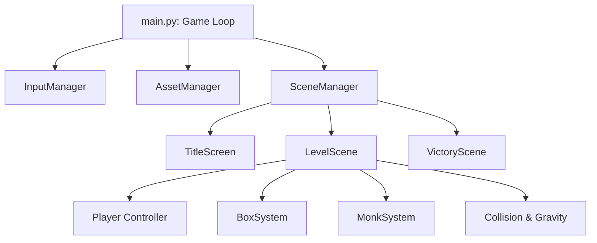

# Architecture Document

## Tech Stack
* **Language:** Python 3.11+
* **Engine:** `pygame-ce` (Pygame Community Edition)
* **Packaging:** PyInstaller (with custom `.spec` files for Windows/Mac)

## System Architecture

The game follows a centralized state-machine architecture driven by `main.py`.

### Core Managers
* **`main.py`:** Handles window management, framerate capping (60 FPS), and dynamic letterbox scaling (Logical 1920x1080 -> Screen Size).
* **`SceneManager`:** Standard state machine routing `update()`, `draw()`, and `handle_events()` to the active scene.
* **`AssetManager`:** Singleton-style robust loader. Caches images, sounds, and fonts. Features a fallback mechanism (returns a pink placeholder if a sprite is missing) to prevent hard crashes.
* **`InputManager`:** Unified input bridge. Reads Keyboard, Gamepad (via `pygame.joystick`), and Mouse/Touch simultaneously, mapping them to abstract actions (`JUMP`, `ACTION`, `LEFT`).

## Data Loading & Asset Pipeline
* **Levels:** Hardcoded rects in `level_layouts.py`.
* **Profiles & Scores:** Read/written as JSON files via `profile_manager.py` into the `data/` directory (mapped to OS-specific AppData paths when frozen).
* **Questions:** Loaded dynamically by `MonkSystem` from `assets/monk_questions.json` or `monk_questions_kids.json`.
* **Controller Maps:** Custom mappings loaded from `data/controller_map.json`.

## Testing Harness
The repository contains a standalone hardware rendering test script (`test.py`). It explicitly compares rendering a procedural Monk graphic using three different backends:
1. Pure Pygame (Raster)
2. Cairo (Vector CPU)
3. Skia (GPU Accelerated Bezier)
This serves as an engine capability demonstration, though the main game relies on the standard Pygame raster pipeline for portability.

## Known Issues
* **Input Mapping Verification (`controller_map.json`):** An audit of the custom controller mappings reveals no direct duplicate button indices across `jump`, `fly_up`, and `fly_down` actions (`jump` is button 2, `fly_up` is button 9, `fly_down` is button 0). However, the `fly_up` and `fly_down` actions share joystick axis bindings (Axis 1) and Hat bindings (Hat 0) with `menu_up` and `menu_down`. This is standard for menu navigation, but developers should ensure `fly_up/down` is strictly disabled during menu states to prevent double-triggering.
